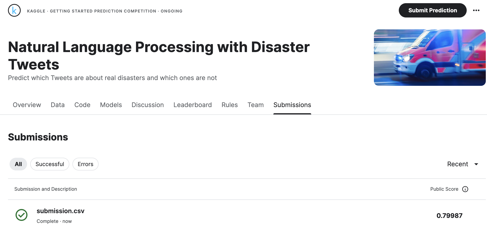
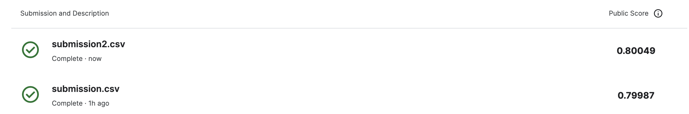
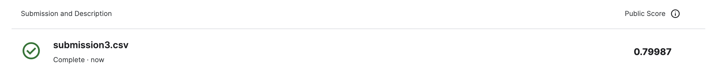
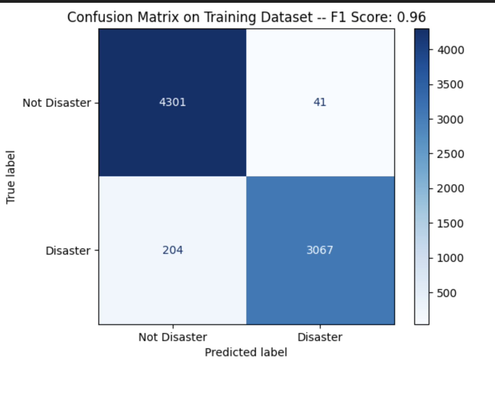
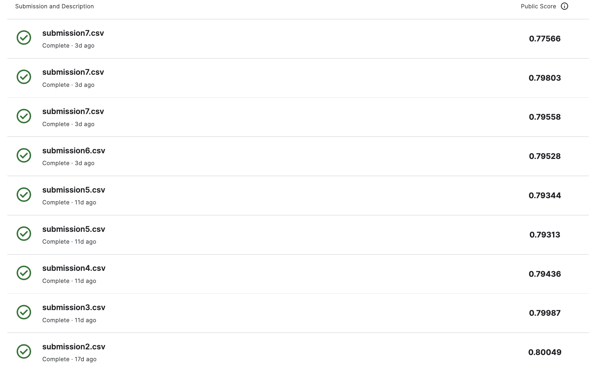

# Disaster Tweet Classification

## Project Overview
This repository contains the code and datasets used in the Kaggle competition aimed at predicting whether a tweet is about a real disaster. The task is a binary classification problem where the goal is to classify tweets as either about a real disaster (`1`) or not (`0`).

## Dataset Description
The dataset includes the following files:
- `train.csv`: Training data with each tweet's text, keyword, location, and the target label.
- `test.csv`: Test data with tweet's text, keyword, and location for which predictions are made.
- `sample_submission.csv`: An example submission file showing the required format for competition entries.
- `submission.csv`: Final submission file to generate score on.

## Submission Scores

#### Submission 1 Score

Got a descent score of 0.79 with basic preprocessing and Logisticregression() model

Went ahead with text normalization techniques like -- converting text to lowercase, removing numbers & punctuations, tokenizing words. Not a significant improvement as we increase the score from 0.79 to 0.80

Removing stopwords did not particularly improve the score.  Confusion matrix for training data and the F1 score suggests that the model might have overtrained and therefore not able to perform well on unseen data. 

Will divide the data into train and validation set. 
 PS. - I KNOW I SHOULD HAVE DONE THIS EARLIER.

Tried various models and found best possible parameters. Got a score of `0.79803`. Couldn't beat the score of `0.8` which I got with just basic data cleaning and using default `Logistic Regression` model. 

